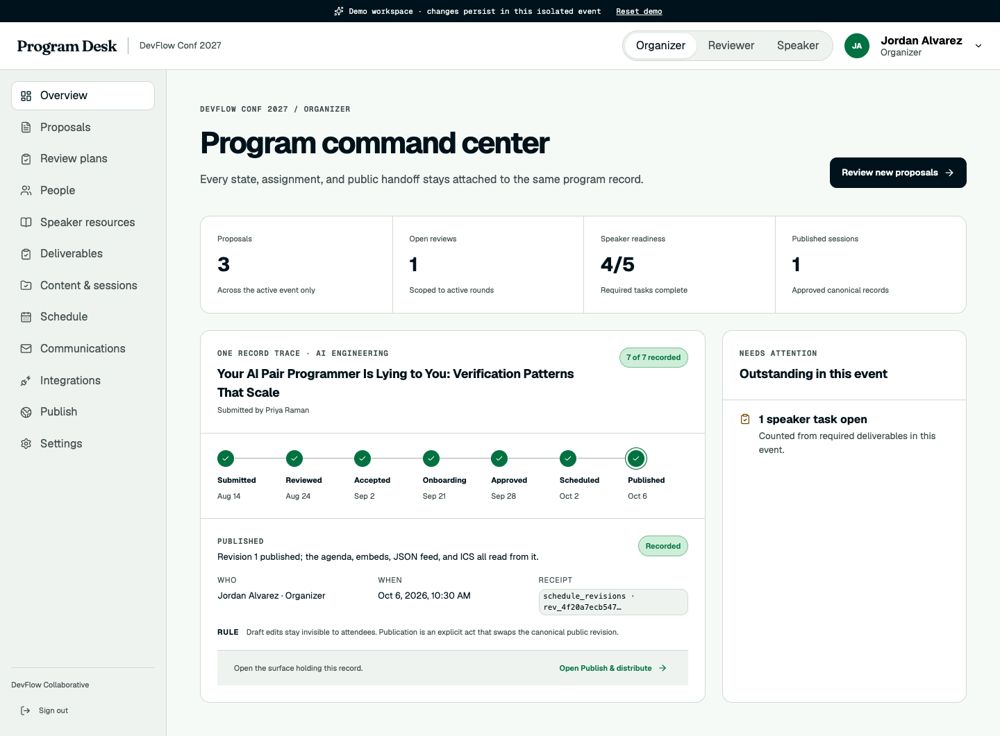

# Program Desk

Program Desk is an open-source conference program operations system built around one persisted record moving through:

`Submitted → Reviewed → Accepted → Onboarding → Approved → Scheduled → Published`

It is a competition-ready alternative to the speaker and content workflow in SessionBoard. The product emphasizes the behavior an organizer has to trust: cross-role handoffs, explicit rules, event isolation, human/AI provenance, schedule revisions, and attendee-facing output that reads from the same approved data.



**Live evaluator build:** [program-desk.ian-208.workers.dev](https://program-desk.ian-208.workers.dev)

**Judge walkthrough:** [docs/JUDGE-WALKTHROUGH.md](docs/JUDGE-WALKTHROUGH.md)

## What works

- A lifecycle trace on the organizer Overview that follows one proposal from submission to published program. Every step cites the actor, the timestamp, the enforced rule, and the database row id behind the claim, and links to the surface holding that record. It is derived from persisted rows through an organizer-only, event-scoped endpoint; stages without evidence report themselves as unrecorded rather than filling in.
- Custom CFP builder with required fields, dropdowns, conditional visibility, public draft/submission flow, deadlines, custom-answer round-tripping, confirmations, and editing locks.
- Independent review rounds, round-specific reviewer pools, reviewer onboarding and capacity, manual and expertise-first balanced assignment, blind review, weighted scorecards, recusal, reminders, export, and human overrides of separate AI advice.
- Event-scoped speaker roster, CSV import, status filters, magic-link invitations, speaker-owned profile/headshot editing, personalized tasks, and logged bulk communications.
- Versioned speaker resources with event-, track-, session-, or speaker-level scope, draft/published state, safe link and iframe normalization, organizer editing, and speaker-only published visibility.
- Session-scoped file requests with constraints, persisted binary uploads, version history, latest markers, cross-role comments, reminders, central file library, and ZIP download.
- Draft and published schedule revisions with rooms, tracks, precise placement, drag movement, duration control, room and speaker conflict rules, automatic placement, explicit overrides, and publication history.
- Five public surfaces: sessions, speakers, agenda, itinerary/personal schedule, and speaker gallery. Each surface uses only approved content in the current published revision.
- Saved embed records, retrievable iframe snippets, JSON/ICS feeds, color/branding/filter/field configuration, multi-event isolation, communication receipts, and audit history.
- Versioned public API routes for events, approved sessions, published agenda revisions, speakers, and iCalendar output, with a discoverable OpenAPI document.
- Accelevents sync receipts with organizer-only connection setup, mutation-free previews, field-level diffs, explicit apply confirmation, unchanged-sync no-ops, retryable failures, and a hard no-delete policy.
- Isolated Demo Mode with Organizer, Reviewer, and Speaker persona switching and a one-click reset.

## Run locally

Prerequisites: Node.js 22+ and pnpm 10+.

```bash
pnpm install
pnpm db:migrate
pnpm dev
```

Open [http://127.0.0.1:5173](http://127.0.0.1:5173). Choose **Enter Demo Mode** for the fastest tour. Every demo launch creates its own persisted organization and event, so edits survive role switching without contaminating another evaluator's run.

## Seeded evaluator accounts

| Persona | Email | Password |
|---|---|---|
| Organizer | `sbek-organizer@example.com` | `SbekTest!2027-org` |
| Reviewer | `sbek-reviewer@example.com` | `SbekTest!2027-rev` |
| Speaker | `sbek-speaker@example.com` | `SbekTest!2027-spk` |
| Co-speaker | `sbek-speaker2@example.com` | `SbekTest!2027-spk2` |

Magic links and application email are written to the in-app outbox in local development; no real email is sent.

Accelevents also defaults to `outbox` mode. An approved apply records deterministic local receipts but does not contact Accelevents. Live delivery requires an Accelevents API key stored as the `ACCELEVENTS_API_KEY` Worker secret and `ACCELEVENTS_SYNC_MODE=live`. Accelevents currently limits API access to Enterprise and White Label plans, so verify the destination plan before relying on live delivery.

## Public API and Accelevents contract

The versioned public contract is available at `/api/v1/openapi.json`. Its event-scoped read routes are:

```text
GET /api/v1/events/:slug
GET /api/v1/events/:slug/sessions
GET /api/v1/events/:slug/speakers
GET /api/v1/events/:slug/agenda
GET /api/v1/events/:slug/agenda.ics
```

The organizer-only Accelevents workflow is deliberately two-stage:

```text
PUT  /api/integrations/accelevents/connection
POST /api/integrations/accelevents/preview
POST /api/integrations/accelevents/runs/:runId/apply  { "confirm": true }
```

Only approved sessions in the current published schedule and their assigned speakers enter a preview. Speaker and session creates/updates use stable Program Desk-to-Accelevents receipts. Removed or unpublished source records become reconciliation warnings; Program Desk never silently deletes the Accelevents copy. The currently documented Accelevents write API does not expose a confirmed speaker-to-session assignment operation, so the preview labels that destination-side check instead of pretending the handoff is complete.

## Verification

```bash
pnpm check
pnpm test:e2e
```

`pnpm check` runs TypeScript, API boundary tests, and a production build. The Playwright E2E suite creates a fresh demo and verifies:

- reviewer API scoping and cross-role review readback;
- repeat review submission against one canonical review;
- acceptance creating a session and five onboarding tasks for each participant;
- independent review-round pools and manual assignments;
- room and speaker conflict blocking, conflict-free placement, and movement;
- speaker bio/headshot propagation to the organizer;
- speaker-resource scoping, draft isolation, safe embed normalization, unsafe HTML rejection, and fresh-read persistence;
- custom CFP field rendering and answer round-tripping;
- two-version deliverable upload, latest marking, and attributed comments;
- manual speaker creation, magic-link invitation, status persistence, and filtering;
- all public surfaces, CFP conditional validation, desktop/mobile overflow, and console state.
- public API event scoping plus the Accelevents `preview → approve → outbox receipt → unchanged no-op` round trip.

The latest `killmysaas-evals` harness was also validated locally with its offline browser smoke suite and a six-area `--dry-run`. A paid LLM judge run is intentionally not invoked by the repository scripts.

## Architecture

Program Desk is a Cloudflare-native React application:

- React 19 and Vite render the organizer, reviewer, speaker, and public surfaces.
- A Hono Worker owns auth, role/event scoping, rules, and application APIs.
- Cloudflare D1 persists workflow records, schedule revisions, communications, audit events, and uploaded file blobs.
- Cloudflare's Vite plugin runs the Worker and SPA together in local development.
- Email defaults to `EMAIL_MODE=outbox`; the UI is honest about logged versus externally delivered messages.

Key directories:

```text
src/                 React application and public surfaces
worker/routes/       API boundaries by workflow
worker/services/     deterministic fixture seeding
migrations/          D1 schema and evaluation-depth migrations
scripts/qa-e2e.mjs   observable cross-role acceptance test
docs/designs/        approved product specification
docs/qa/             browser QA evidence
```

## Cloudflare setup

The checked-in `wrangler.jsonc` points to the competition deployment's D1 database. For a separate fork, create a new D1 database, replace that ID, apply the remote migrations, and set production variables before deploying.

```bash
pnpm wrangler d1 create program-desk
pnpm wrangler d1 migrations apply program-desk --remote
pnpm deploy
```

Review production email delivery, secrets, retention, and access policies before deploying. The current build is safe for local evaluation because outbound communications remain in the application outbox.

## Product boundary

The required conference-program chain is the product. A broad cross-event Speaker CRM is intentionally outside the first release; the event-scoped roster contains the profile, logistics, task, file, communication, and session data needed for the judged workflows without diluting the core handoffs.

See the [approved product specification](docs/designs/2026-08-11-program-desk-product-spec.md) for the decision receipt and detailed behavior.

## License

MIT. See [LICENSE](LICENSE).
